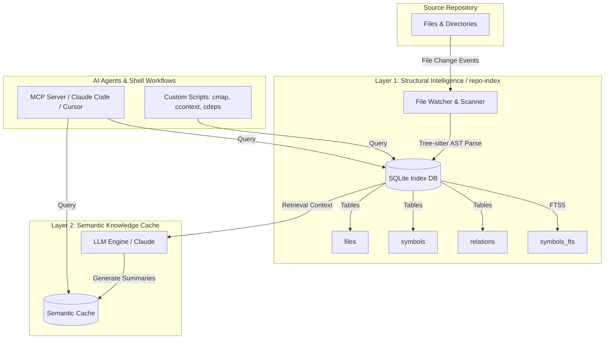

# AI Infra Layer: Persistent Repository Intelligence

This repository houses the foundational infrastructure for a **local-first, AST-aware, persistent repository intelligence system**. It is designed to serve as the semantic operating system and memory substrate for your terminal workflows, custom shell scripts, and AI coding agents (Claude Code, Cursor, Codex, etc.).

---

## 📖 Vision & Core Philosophy

Most AI coding workflows suffer from **ephemeral context**. Every new agent session or script execution repeatedly scans the codebase using regex-based tools (`grep`, `ripgrep`, `fd`), lacking true understanding of Abstract Syntax Trees (AST), call graphs, or git branch state.

Our core architectural principle is:

```
FACTS != INTERPRETATION
```

We separate repository intelligence into two distinct layers:

### Layer 1: Structural Intelligence (Source of Truth)
Maintained by the `repo-index` daemon. It ingests code, parses strict ASTs via Tree-sitter, extracts symbols (functions, classes, methods), resolves imports, and builds relational call graphs. All structural facts are persisted in a high-performance SQLite database with FTS5 full-text search. **No LLM is required for Layer 1 queries.**

### Layer 2: Semantic Knowledge Cache (Derived Data)
Built on top of Layer 1. It stores compressed, LLM-generated semantic summaries (function → module → subsystem → repo hierarchy), architectural invariants, and risk maps. If code changes, Layer 1 detects the exact AST diff and selectively invalidates the corresponding Layer 2 semantic cache.

---

## 🏛️ System Architecture



---

## 🚀 How to Use This as Your AI Infra Layer

### 1. Upgrading Existing Shell Workflows & Scripts
Your existing terminal environment contains powerful custom scripts (`cboot`, `cmap`, `ccontext`, `cdeps`, `cfail`, `cmissing`, `cpr`, `cswagger`). Currently, these rely on `grep` and shell orchestration. 

By refactoring them to query the `repo-index` persistent daemon, you transform them into lightning-fast, AST-accurate tools:

*   **`ccontext` (LLM Context Assembly):**
    *   *Old Approach:* Grepping for function definitions and manually finding imports.
    *   *New Approach:* Run `repo-index context <symbol_name> --depth 2`.
    *   *Benefit:* Instantly returns a clean, structured summary containing direct calls, callers, file imports, transitive call graphs, and blast radius—perfectly formatted for LLM prompts.
*   **`cdeps` & `cmap` (Dependency & Call Graph Tracing):**
    *   *Old Approach:* Grepping function names across the codebase (prone to regex false positives).
    *   *New Approach:* Run `repo-index deps <symbol_name> --depth 3`.
    *   *Benefit:* Uses pre-parsed AST relations and NetworkX BFS traversal to guarantee 100% accurate call chains.
*   **`cfail` & `cpr` (Blast Radius & PR Impact Analysis):**
    *   *Old Approach:* Manual inspection or reverse grepping.
    *   *New Approach:* Run `repo-index impact <modified_symbol> --depth 3`.
    *   *Benefit:* Instantly identifies every upstream function, method, or workflow that transitively depends on the modified symbol, allowing precise risk assessment and targeted testing.

### 2. Supercharging AI Coding Agents (Claude Code, Cursor, Codex)
AI agents waste significant time and token limits exploring repository structures. You can integrate `repo-index` into your agentic workflows in two ways:
1.  **CLI Tooling Access:** Give agents terminal execution rights to run `repo-index search`, `repo-index context`, and `repo-index impact`. Instead of letting agents flail with `find` or `grep`, instruct them in their system prompt: *"Always use `repo-index search` to locate symbols and `repo-index context` to understand dependencies before modifying code."*
2.  **Model Context Protocol (MCP):** Expose `repo-index` via an MCP server. This allows Claude Code and Cursor to natively call tools like `get_symbol_context` or `get_blast_radius`, providing them with persistent, compiler-grade repository memory.

### 3. Operational Workflow: The Persistent Daemon
To maintain real-time repository intelligence without manual re-indexing, use the following operational pattern:

```bash
# 1. Initial Indexing (Scans repo, builds SQLite DB, calculates SHA-1 hashes)
repo-index build /path/to/your/repo

# 2. Live Incremental Daemon (Runs in background/tmux)
# Listens to CREATED, MODIFIED, DELETED, and MOVED events.
# Uses content hashing to update the AST index in milliseconds.
repo-index watch /path/to/your/repo
```

**Branch-Aware Memory:** When you switch git branches, `repo-index` tracks per-branch snapshots. It preserves indexed symbols and relations across branches, ensuring that you never have to perform a full re-index just because you checked out a feature branch.

---

## 📦 Directory Structure

*   [`repo-index/`](repo-index/): The core Layer 1 structural intelligence daemon, CLI, and Python package. See the [repo-index Technical Documentation](repo-index/README.md) for full installation instructions, CLI commands, database schemas, and Python API usage.
*   [`.claude/`](.claude/): Project architectural context and local AI agent settings.

---

## 🗺️ Roadmap

*   **Phase 1–4 (Complete):** AST indexing, SQLite persistence, incremental file watching, branch-aware storage, and hybrid FTS5/Graph retrieval.
*   **Phase 5 (Active):** Semantic Summarization — LLM-generated summaries per symbol, hierarchically stored from function → module → subsystem → repo.
*   **Phase 6 (Planned):** Model Context Protocol (MCP) server integration for seamless plug-and-play with Claude Code and Cursor.
