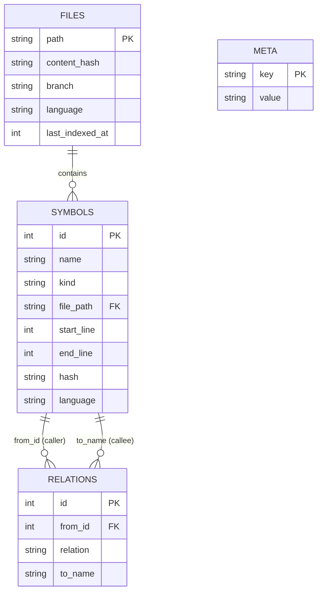

# repo-index: AST-Aware Repository Intelligence

`repo-index` is a lightning-fast, local-first repository indexing and retrieval daemon. It serves as **Layer 1 (Structural Intelligence)** of the AI Infra Layer, utilizing Tree-sitter for robust Abstract Syntax Tree (AST) parsing, SQLite + FTS5 for structured storage and full-text search, and NetworkX for call graph analysis.

---

## ✨ Key Features

*   **AST-Powered Indexing:** Extracts precise symbol definitions (functions, classes, methods, modules) and their exact line ranges across Python codebases.
*   **Relational Call Graphs:** Tracks `CALLS` and `IMPORTS` relationships between symbols to understand codebase topology.
*   **Incremental & Branch-Aware:** Uses SHA-1 content hashing and git branch tracking to update only what changes, avoiding expensive full re-indexing.
*   **Live Filesystem Watcher:** Background daemon that instantly updates the AST index on file CREATED, MODIFIED, DELETED, or MOVED events.
*   **Rich CLI & Retrieval Engine:** Provides beautiful, terminal-native outputs for dependency tracing, blast radius analysis, and LLM context assembly.

---

## 🛠️ Installation

Ensure you have Python 3.10+ installed.

### Via pip (Recommended)

```bash
pip install repo-index
```

### From source (for development)

```bash
git clone https://github.com/aryanwalia/ai-infra.git
cd ai-infra/repo-index
pip install -e .
```

### Database Location

By default, `repo-index` stores its SQLite database at:
`~/.local/share/repo-index/index.db`

*(You can override this location using the `--db` CLI option or the `REPO_INDEX_DB` environment variable).*

---

## 💻 CLI Reference

`repo-index` provides a comprehensive suite of commands for indexing, querying, and analyzing your codebase.

### 1. Index Management & Daemon
*   **`repo-index build [PATH] [--db PATH]`**
    Scans and indexes a repository root. Calculates file content hashes, parses ASTs, and populates the SQLite index.
*   **`repo-index watch [PATH] [--skip-build] [--db PATH]`**
    Starts the live filesystem watcher daemon. Listens for changes and incrementally updates the index in milliseconds.
*   **`repo-index stats`**
    Displays overall index statistics, including total files, symbols, and relations broken down by kind and language.
*   **`repo-index branch [PATH]`**
    Shows the currently active git branch and displays per-branch index statistics (files and symbols indexed per branch).
*   **`repo-index files`**
    Lists all indexed files along with their detected language and SHA-1 content hash.

### 2. Query & Inspection
*   **`repo-index search <query> [--kind function/class/method/module] [--limit N]`**
    Performs an FTS5 BM25 full-text search across all indexed symbol names and file paths.
*   **`repo-index symbol <name>`**
    Looks up exact symbol details, displaying its AST kind, file path, line ranges, and language.
*   **`repo-index callers <name>`**
    Finds all direct callers of a specific function or method across the codebase.
*   **`repo-index imports <file_path>`**
    Lists all module-level imports within a specific file.

### 3. Advanced AI & Graph Retrieval
*   **`repo-index deps <name> [--depth N]`**
    Performs a Breadth-First Search (BFS) forward through the call graph to show what `<name>` transitively calls up to depth `N`.
*   **`repo-index impact <name> [--depth N]`**
    Performs a BFS backward through the call graph to analyze the **blast radius** (what transitively calls `<name>` up to depth `N`).
*   **`repo-index context <name> [--depth N]`**
    **The Crown Jewel for AI Agents:** Assembles the full retrieval context for a symbol (direct calls, callers, file imports, transitive call graph, and blast radius) into a single, structured summary ready to be injected into LLM prompts.

---

## 🗄️ Database Schema

The underlying SQLite database is fully optimized with `WAL` journal mode and foreign key constraints.



*   **`symbols_fts` (Virtual Table):** FTS5 table over `name`, `kind`, and `file_path`. Automatically kept in sync with the `symbols` table via SQLite `AFTER INSERT` and `AFTER DELETE` triggers.
*   **`meta`:** Key-value store maintaining repository state, such as `current_branch`.

---

## 🐍 Python API Reference

You can import `repo-index` directly into custom Python scripts, AI orchestration workflows, or MCP servers:

```python
from pathlib import Path
from repo_index import db, retrieval, graph

# 1. Connect to the SQLite Index DB
conn = db.open_db(Path.home() / ".local/share/repo-index/index.db")

# 2. Perform an FTS5 Search
results = retrieval.search(conn, query="auth", kind="function", limit=5)
for r in results:
    print(f"Found {r.kind} {r.name} at {r.file_path}:{r.start_line}")

# 3. Assemble Full LLM Retrieval Context
ctx = retrieval.get_context(conn, name="open_db", callgraph_depth=2)
if ctx:
    print(f"Symbol: {ctx.name} ({ctx.kind}) in {ctx.file_path}")
    print(f"Direct Calls: {ctx.calls}")
    print(f"Called By: {ctx.called_by}")
    print(f"File Imports: {ctx.file_imports}")
    print(f"Transitive Call Graph: {ctx.callgraph}")
    print(f"Blast Radius (Impact): {ctx.impact}")

# 4. Advanced Graph Traversal
G = graph.build_call_graph(conn)
# G is a NetworkX DiGraph where edges represent CALLS relations.
# Use standard NetworkX algorithms for custom architectural analysis.
```

---

## 🧪 Development & Testing

The codebase includes a robust `pytest` test suite covering AST parsing, database operations, incremental watching, and graph retrieval.

```bash
# Run the full test suite
pytest tests/ -v
```
